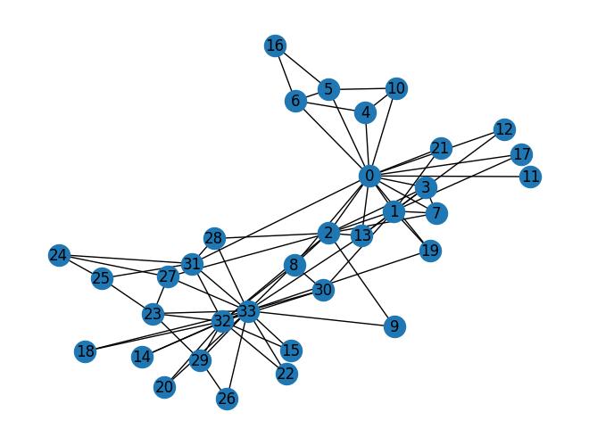
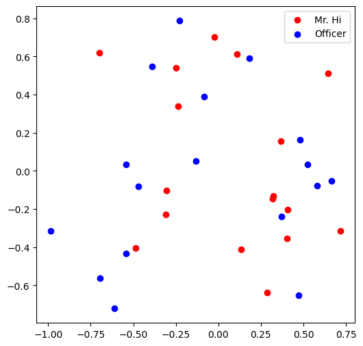
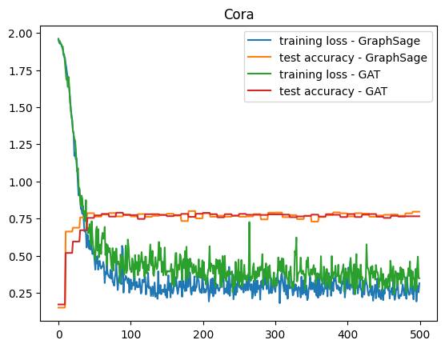
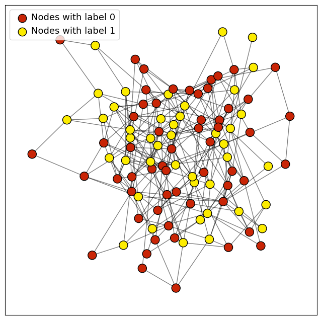
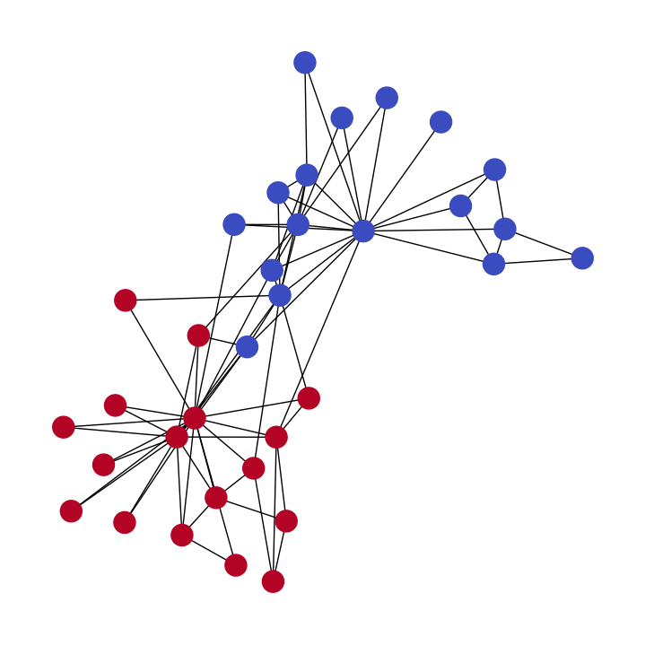
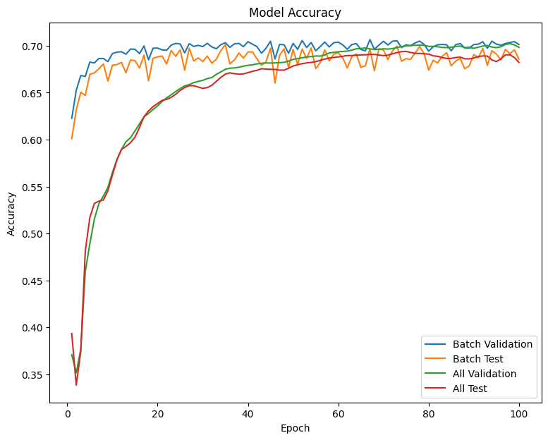

# 🎓 Stanford XCS224W: Machine Learning with Graphs

> **Course Completed with Full Marks** ✅

<div align="center">


</div>

## 👤 About Me

**Deokhwa Jeong** | PMP | Software Engineer

I worked at LG Electronics (Smart TV division), starting at the R&D Center and later moving to the Seoul headquarters, where I led cross-functional initiatives in product and software development.
During my M.S. studies in Molecular & Cell Biology, I conducted research on 3D cell structure reconstruction using High-Voltage Electron Microscopy and Java-based modeling.
I completed Stanford's XCS224W course on Machine Learning with Graphs with full marks.

### Background
- 🎓 M.S. in Molecular & Cell Biology
- 💼 10+ years at LG Electronics as a Software Engineer & Project Manager
- 📜 PMP Certified

---

## 📚 Course Overview

**XCS224W: Machine Learning with Graphs** is Stanford's graduate-level course taught by **Prof. Jure Leskovec**, a leading researcher in graph machine learning and founder of [GraphSAGE](https://arxiv.org/abs/1706.02216).

### Topics Covered
- Node Embeddings & Graph Representation Learning
- Graph Neural Networks (GNNs)
- Message Passing Neural Networks
- GraphSAGE & Graph Attention Networks (GAT)
- Heterogeneous Graphs
- Knowledge Graphs & Link Prediction
- Graph Generation & Applications

---

## 📝 Assignments & Results

### Colab 1: Node Embeddings & Graph Basics
[](https://colab.research.google.com/github/deokhwajeong/stanford-xcs224w/blob/main/XCS224W_Colab1.ipynb)

**Topics:**
- Graph statistics analysis on Zachary's Karate Club Network
- NetworkX fundamentals
- Node embedding implementation
- PyTorch tensor transformations for graphs

**Key Implementations:**
- Calculated graph properties (degree, clustering coefficient, PageRank)
- Built node embedding pipeline from scratch
- Implemented graph-to-tensor transformations

**Visual Outputs:**

<div align="center">
<table>
<tr>
<td align="center"><b>Zachary's Karate Club Network</b></td>
<td align="center"><b>Node Embeddings (2D Visualization)</b></td>
</tr>
<tr>
<td></td>
<td></td>
</tr>
</table>
</div>

*Left: 34-node social network graph | Right: Learned node embeddings showing Mr. Hi (red) vs Officer (blue) club members*

---

### Colab 2: Graph Neural Networks with PyTorch Geometric
[](https://colab.research.google.com/github/deokhwajeong/stanford-xcs224w/blob/main/XCS224W_Colab2.ipynb)

**Topics:**
- PyTorch Geometric (PyG) framework
- Node Property Prediction (Open Graph Benchmark)
- Graph Property Prediction

**Results:**

| Task | Model | Train Acc | Valid Acc | Test Acc |
|------|-------|-----------|-----------|----------|
| Node Classification | GCN | 73.80% | 72.01% | **71.19%** |
| Node Classification | GCN (Improved) | 79.77% | 77.35% | **73.30%** |
| Graph Classification | Mean Pooling | 96.23% | 97.96% | **96.84%** |
| Graph Classification | Sum Pooling | 96.43% | 97.54% | **96.99%** |
| Graph Classification | Max Pooling | 96.23% | 97.96% | **96.69%** |

---

### Colab 3: GraphSAGE, GAT & Link Prediction
[](https://colab.research.google.com/github/deokhwajeong/stanford-xcs224w/blob/main/XCS224W_Colab3.ipynb)

**Topics:**
- Custom GNN layer implementation
- GraphSAGE ([Hamilton et al., 2017](https://arxiv.org/abs/1706.02216))
- Graph Attention Networks (GAT) ([Veličković et al., 2018](https://arxiv.org/abs/1710.10903))
- DeepSNAP for heterogeneous graphs
- Link Prediction tasks

**Results:**

| Task | Model | Test Accuracy | Notes |
|------|-------|---------------|-------|
| Node Classification (CORA) | GraphSAGE | **80.0%** | Custom implementation |
| Node Classification (CORA) | GAT | **78.9%** | Multi-head attention |
| Link Prediction (CORA) | GCN | **90.2%** (AUC) | Best Val: 91.2% |

**Visual Outputs:**

<div align="center">
<table>
<tr>
<td align="center"><b>Training Curves (GraphSAGE vs GAT)</b></td>
<td align="center"><b>Link Prediction Graph</b></td>
</tr>
<tr>
<td></td>
<td></td>
</tr>
</table>
</div>

*Left: Loss and accuracy curves on CORA dataset | Right: Graph visualization with node labels (red=0, yellow=1)*

---

### Colab 4: Heterogeneous Graphs & Knowledge Graphs
[](https://colab.research.google.com/github/deokhwajeong/stanford-xcs224w/blob/main/XCS224W_Colab4.ipynb)

**Topics:**
- Heterogeneous Graph Neural Networks
- Multiple node and edge types
- Heterogeneous message passing
- Knowledge Graph completion

**Results:**

| Task | Model | Train Acc | Valid Acc | Test Acc |
|------|-------|-----------|-----------|----------|
| Heterogeneous Node Classification | HeteroGNN (v1) | 100.0% | 97.0% | **83.0%** |
| Heterogeneous Node Classification | HeteroGNN (v2) | 100.0% | 96.3% | **82.1%** |
| Large-scale HeteroGNN | Sampling-based | 76.9% | 70.1% | **68.6%** |
| Knowledge Graph | TransE | 71.9% | 69.8% | **68.2%** |

**Visual Outputs:**

<div align="center">
<table>
<tr>
<td align="center"><b>Heterogeneous Graph Structure</b></td>
<td align="center"><b>Knowledge Graph Embeddings</b></td>
</tr>
<tr>
<td></td>
<td></td>
</tr>
</table>
</div>

*Left: Heterogeneous graph with multiple node/edge types | Right: Knowledge graph relation embeddings*

---

## 🛠️ Technologies & Skills

<div align="center">

| Category | Technologies |
|----------|-------------|
| **Languages** | Python 3.11 |
| **Deep Learning** | PyTorch, PyTorch Geometric |
| **GNN Frameworks** | PyG, DeepSNAP |
| **Graph Libraries** | NetworkX, OGB (Open Graph Benchmark) |
| **Development** | Google Colab, Jupyter Notebook |
| **Data Processing** | NumPy, Pandas, Matplotlib |

</div>

---

## 📊 Performance Summary

```
┌──────────────────────────────────────────────────────────────┐
│                    XCS224W ACHIEVEMENTS                       │
├──────────────────────────────────────────────────────────────┤
│  ✅ Colab 1: Node Embeddings           - COMPLETED (100%)    │
│  ✅ Colab 2: GNN with PyG              - COMPLETED (100%)    │
│  ✅ Colab 3: GraphSAGE & GAT           - COMPLETED (100%)    │
│  ✅ Colab 4: Heterogeneous Graphs      - COMPLETED (100%)    │
├──────────────────────────────────────────────────────────────┤
│                 FINAL GRADE: 100%  🏆                         │
└──────────────────────────────────────────────────────────────┘
```

---

## 🔗 Key Learning Outcomes

1. **Graph Representation Learning**: Mastered node embedding techniques including matrix factorization and random walk approaches

2. **GNN Architectures**: Implemented and compared GCN, GraphSAGE, and GAT architectures from scratch

3. **Real-world Applications**: Applied GNNs to node classification, graph classification, and link prediction tasks

4. **Heterogeneous Graphs**: Learned to handle multiple node/edge types with heterogeneous message passing

5. **Scalability**: Implemented mini-batch training with neighbor sampling for large-scale graphs

---

## 📁 Repository Structure

```
stanford-xcs224w/
├── README.md                    # This portfolio
├── XCS224W_Colab1.ipynb        # Node Embeddings & Graph Basics
├── XCS224W_Colab2.ipynb        # GNN with PyTorch Geometric
├── XCS224W_Colab3.ipynb        # GraphSAGE, GAT & Link Prediction
├── XCS224W_Colab4.ipynb        # Heterogeneous Graphs
└── model_predictions.csv       # Model output predictions
```

---

## 🚀 Coming Soon

- **Bio-Graph Project**: Applying graph ML to biological data combined with TV viewership patterns
- **3D Cell Reconstruction**: Java-based 3D reconstruction of cell ultrastructure from HVEM tilt-series
- **TV Feature Analytics**: Tableau dashboards for TV feature analysis

---

## 📬 Contact

**Deokhwa Jeong**
- GitHub: [@deokhwajeong](https://github.com/deokhwajeong)

---

<div align="center">

*This repository showcases completed coursework from Stanford's XCS224W: Machine Learning with Graphs*


</div>
